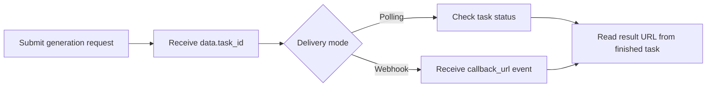

# Kling 3.0 Motion Control API with APIDot

Build with the Kling 3.0 Motion Control API using APIDot: cURL, Node.js, request variants, pricing, and production notes in one GitHub repo.

[Try on APIDot](https://apidot.ai/models/kling-3-0-motion-control) | [Get API Key](https://apidot.ai/dashboard/api-key) | [API Docs](https://apidot.ai/docs/kling-3-0-motion-control) | [Pricing](https://apidot.ai/pricing) | [Main Examples](https://github.com/APIDotAI/apidot-examples)

## Why this repo exists

Kling 3.0 Motion Control transfers motion from one reference video onto one character image for controllable animation, dance transfer, action transfer, ad creative, and storyboard previews.

This repository turns that APIDot workflow into runnable server-side examples: a verified cURL request, a native Node.js example, request variants, pricing context, and production integration guardrails.

## Overview

Kling 3.0 Motion Control uses APIDot's shared async generation workflow. Send `model: "kling-3.0-motion-control"`, an optional `callback_url`, and the supported motion-control fields inside `input`. The public request surface accepts one reference image, one reference video, `character_orientation`, optional `prompt`, and optional `resolution`.

## Capabilities

- Use a clear JPEG or PNG character image with the full subject visible when body motion matters.
- Use a stable MP4 or MOV reference video where the desired motion is visible for the full clip.
- Choose `character_orientation: "image"` when you want to preserve the source image's pose and framing, or `"video"` when the reference video's direction and framing should dominate.
- Keep reference videos at least 3 seconds. Use up to 10 seconds for `image` orientation and up to 30 seconds for `video` orientation.
- Add an optional `prompt` only for scene, lighting, camera, or style guidance. Do not send internal provider fields.
- Validate file size and media type before upload: images up to 10MB, videos up to 100MB.

## Common use cases

- Product and marketing asset generation
- Backend media workflow prototypes
- Creative testing and prompt iteration
- Production integrations that need stable API examples

## Pricing on APIDot

Catalog price: Starting at 9 credits per second | 720p: 9 credits/sec ($0.045), 1080p: 15 credits/sec ($0.075).

| Tier | Model | Resolution | Credits | APIDot listed price | fal.ai listed price |
| --- | --- | --- | ---: | ---: | ---: |
| 720p | kling-3.0-motion-control | 720p | 9 | $0.045 | $0.126 |
| 1080p | kling-3.0-motion-control | 1080p | 15 | $0.075 | $0.168 |

This README uses pricing data currently published in the APIDot model catalog. Check the APIDot model page before high-volume production runs.

## Quick start

    cp .env.example .env
    # Edit .env and set APIDOT_API_KEY
    cd node
    npm start

The same request shape is available as a copy-paste cURL example in curl/generate.md.

## API workflow



Use polling for local tests and webhook delivery for production queues. Store `data.task_id` before the first status check so retries, callbacks, and result URLs can be reconciled safely.

## Minimal API request

Submit to APIDot:

    POST https://api.apidot.ai/api/generate/submit
    Authorization: Bearer <APIDOT_API_KEY>
    Content-Type: application/json

Primary payload:

```json
{
  "model": "kling-3.0-motion-control",
  "input": {
    "prompt": "optional scene prompt",
    "image_urls": [
      "https://your-domain.com/character.png"
    ],
    "video_urls": [
      "https://your-domain.com/reference-motion.mp4"
    ],
    "character_orientation": "image",
    "resolution": "720p"
  }
}
```

Submit Kling 3.0 Motion Control reference-video motion transfer jobs through APIDot's unified async generation endpoint.

## Model IDs and request variants

### Match image orientation

```json
{
  "model": "kling-3.0-motion-control",
  "callback_url": "https://your-domain.com/callback",
  "input": {
    "prompt": "Transfer the dance motion to the uploaded character, keep the character identity stable, clean studio lighting",
    "image_urls": [
      "https://your-domain.com/character.png"
    ],
    "video_urls": [
      "https://your-domain.com/reference-motion.mp4"
    ],
    "character_orientation": "image",
    "resolution": "720p"
  }
}
```

### Match video orientation

```json
{
  "model": "kling-3.0-motion-control",
  "callback_url": "https://your-domain.com/callback",
  "input": {
    "prompt": "Follow the reference video's camera framing and action rhythm for an energetic product mascot clip",
    "image_urls": [
      "https://your-domain.com/mascot.png"
    ],
    "video_urls": [
      "https://your-domain.com/action-reference.mov"
    ],
    "character_orientation": "video",
    "resolution": "1080p"
  }
}
```

## Request parameters

| Field | Type | Required | Description |
| --- | --- | --- | --- |
| model | string | yes | Target model id. Use `kling-3.0-motion-control`. |
| callback_url | string | no | Optional webhook callback URL for terminal task updates. |
| input.prompt | string | no | Optional scene, style, lighting, camera, or motion guidance. Maximum length is 2500 characters. |
| input.image_urls | string[] | yes | Required image URL array. Provide exactly one JPEG or PNG image up to 10MB. |
| input.video_urls | string[] | yes | Required reference video URL array. Provide exactly one MP4 or MOV video up to 100MB. |
| input.character_orientation | string | yes | Controls character orientation. Supported values are `image` and `video`. |
| input.resolution | string | no | Output resolution. Supported values are `720p` and `1080p`; default is `720p`. |

## Practical integration notes

- Keep APIDot API keys in server-side environment variables.
- Persist selected model, request payload, user ID, and response metadata together.
- Validate source media URLs before submitting requests that depend on source files.
- Avoid logging API keys, private prompts, private media URLs, or callback URLs.
- Store task_id immediately and use polling or callback_url for durable async delivery.

## Response and errors

- `code`: HTTP-style status code. Successful calls return `200`.
- `data.task_id`: Async task identifier returned immediately after submission.
- `data.status`: Initial task status, typically `not_started`.

Common error classes:

- `400 invalid_request`: Missing fields or unsupported parameter combinations.
- `401 authentication_error`: Missing, expired, or invalid Bearer API key.
- `402 insufficient_credits`: The current prepaid balance cannot cover the job.
- `429 rate_limited`: Request rate is temporarily above the current allowed limit.

## Example response

```json
{
  "code": 200,
  "data": {
    "task_id": "task-unified-example",
    "status": "finished",
    "output": {
      "files": [
        {
          "file_url": "https://example.com/generated-video.mp4",
          "file_type": "video"
        }
      ]
    },
    "error_message": null
  }
}
```

## Production notes

- Keep APIDot API keys in server-side environment variables.
- Persist selected model, request payload, user ID, and response metadata together.
- Validate source media URLs before submitting requests that depend on source files.
- Avoid logging API keys, private prompts, private media URLs, or callback URLs.
- Retry transient network failures with backoff, but do not retry unchanged invalid payloads.

## FAQ

### Which model id should I send?

Use `kling-3.0-motion-control` in the top-level `model` field.

### Are image_urls and video_urls required?

Yes. Send exactly one image URL in `input.image_urls` and exactly one video URL in `input.video_urls`.

### Is prompt required?

No. `input.prompt` is optional and can be used for scene, style, lighting, or camera guidance. The maximum length is 2500 characters.

### Which resolutions are supported?

Use `720p` or `1080p`. If omitted, APIDot defaults to `720p`.

### Which media formats should I use?

Use JPEG or PNG for images, and MP4 or MOV for videos. The public docs and playground expose only these formats.

## Related links

- Website: https://apidot.ai
- Docs: https://apidot.ai/docs
- Kling 3.0 Motion Control docs: https://apidot.ai/docs/kling-3-0-motion-control
- Kling 3.0 Motion Control model page: https://apidot.ai/models/kling-3-0-motion-control
- GitHub repo: https://github.com/APIDotAI/kling-3-0-motion-control-api
- Main examples: https://github.com/APIDotAI/apidot-examples
